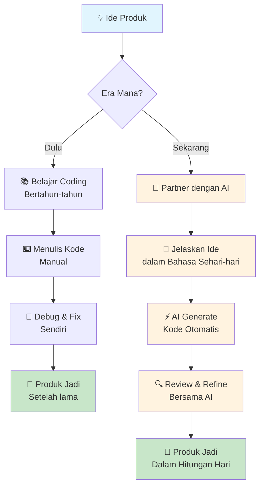
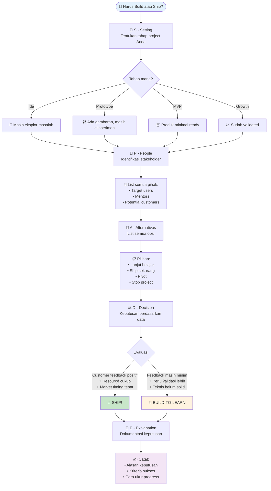
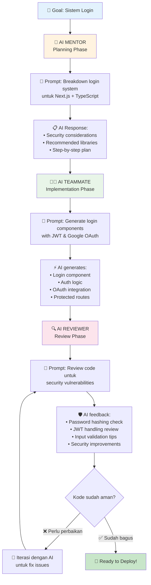
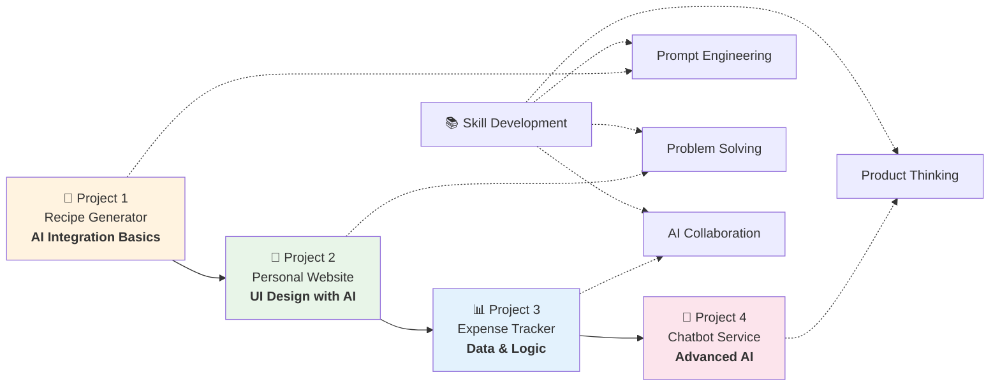
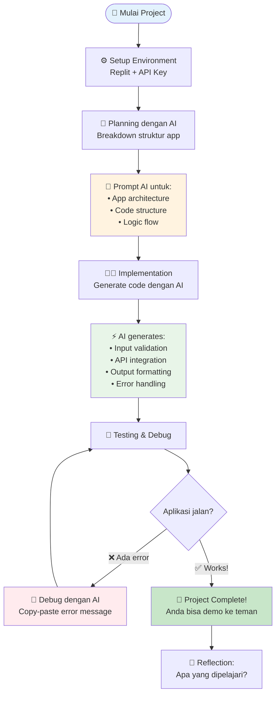
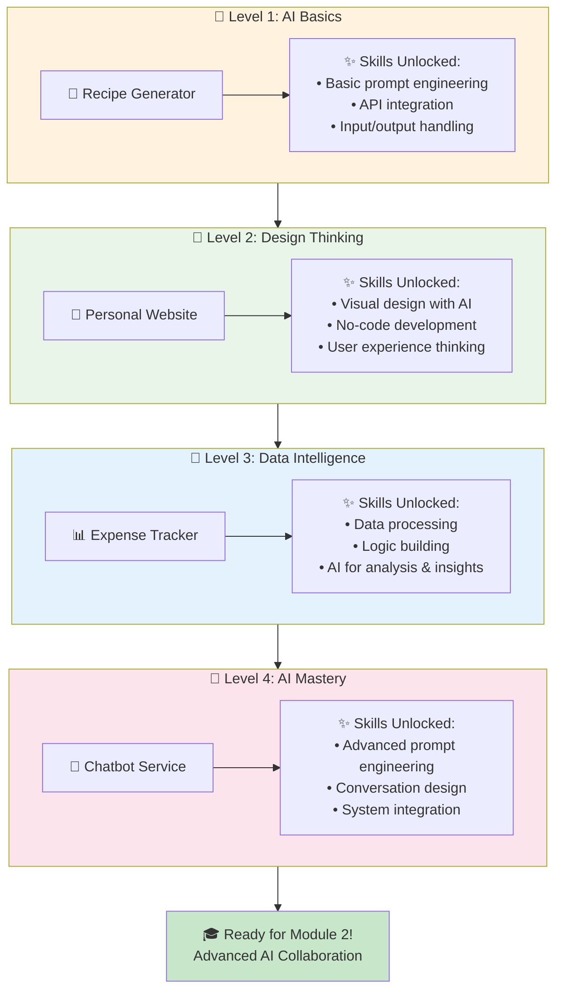

# 🚀 Modul 1: Fondasi & Mindset AI-First Development

## 📋 Ringkasan Modul

Selamat datang di era baru pengembangan produk digital! Modul ini akan mengubah cara Anda memandang pembuatan aplikasi dan website - dari yang tadinya rumit dan butuh bertahun-tahun belajar coding, menjadi sesuatu yang bisa Anda kuasai dalam hitungan hari dengan bantuan AI. Bayangkan AI sebagai partner kerja super pintar yang bisa membantu Anda mewujudkan ide menjadi produk nyata, bahkan tanpa latar belakang teknis yang mendalam.

## 🎯 Learning Objectives

Setelah menyelesaikan modul ini, Anda akan mampu:
- [ ] Memahami peran AI sebagai partner pengembangan, bukan sekadar alat bantu
- [ ] Menentukan kapan sebaiknya fokus belajar versus kapan langsung meluncurkan produk
- [ ] Menggunakan AI untuk review kode, mentoring, dan kolaborasi pengembangan
- [ ] Mengenali tools dan platform terbaru untuk pengembangan solo dengan AI
- [ ] Membangun mindset product builder yang efektif di era AI

## 📚 Materi Pembelajaran

### 🧠 **Mindset Product Builder: AI sebagai Co-creator, Bukan Sekadar Tools**

#### 💡 Konsep Dasar

Mari kita mulai dengan mengubah mindset fundamental. Selama ini, banyak orang berpikir bahwa untuk membuat aplikasi atau website, mereka harus jadi "programmer" terlebih dahulu - menghabiskan bertahun-tahun belajar bahasa pemrograman yang rumit. Tapi di tahun 2025, realitasnya sudah berubah total.

Pikirkan AI seperti asisten super pintar yang bisa berbahasa Indonesia. Alih-alih Anda harus belajar "bahasa mesin" yang rumit, sekarang Anda cukup menjelaskan keinginan Anda dalam bahasa sehari-hari, dan AI akan menerjemahkannya menjadi kode yang berfungsi. Ini seperti perbedaan antara harus belajar bahasa Jepang untuk pesan sushi, versus punya translator langsung yang memahami "saya mau sushi salmon dengan nasi extra".

**Perubahan Paradigma:**



Diagram di atas menunjukkan perbedaan dramatis antara pendekatan tradisional dan AI-first development. Perhatikan bagaimana AI memungkinkan kita untuk melompati tahap-tahap yang memakan waktu dan langsung fokus pada problem solving.

#### 🛠️ Implementasi Praktis

**Langkah 1: Pahami Peran Baru Anda**
Sebagai product builder di era AI, fokus Anda bukan lagi pada sintaks coding yang rumit, tapi pada:
- Memahami masalah yang ingin diselesaikan
- Merancang solusi yang user-friendly  
- Berkomunikasi efektif dengan AI
- Menguji dan memperbaiki produk berdasarkan feedback

**Langkah 2: Kenali Tools AI Terdepan**
Berikut tools yang akan menjadi sahabat Anda:

**Cursor IDE** - Seperti Microsoft Word, tapi untuk membuat aplikasi. Anda tinggal ketik instruksi dalam bahasa Indonesia, Cursor akan menulis kodenya. Biaya sekitar $20/bulan, tapi value yang didapat luar biasa.

**Replit Agent** - Bayangkan punya asisten yang bisa membuat aplikasi lengkap hanya dari deskripsi Anda. Cukup ketik "buatkan saya aplikasi todo list yang bisa sinkron antar device", dan dalam hitungan menit aplikasinya sudah jadi.

**v0 by Vercel** - Khusus untuk membuat tampilan website/aplikasi. Anda describe tampilan yang diinginkan, v0 langsung generate komponennya.

#### 💻 Contoh Nyata

Mari lihat bagaimana entrepreneur sukses memanfaatkan AI:

**Kasus Bhanu Teja (SiteGPT):**
- Weekend: Buat prototype chatbot untuk website
- Minggu 1: Test dengan beberapa teman
- Bulan 1: $1,000 revenue pertama  
- Bulan 6: $15,000/bulan
- Sekarang: $20,000+/bulan

Yang menarik, Bhanu bukan programmer senior. Dia product builder yang memanfaatkan AI untuk mengeksekusi idenya dengan cepat.

#### ⚡ Pro Tips

> **💡 Tip Emas:** Jangan terjebak perfectionism teknis. Fokus pada problem solving dan user experience. AI akan handle kompleksitas teknisnya. Yang terpenting adalah Anda paham masalah yang ingin diselesaikan dan bisa menjelaskannya dengan jelas ke AI.

> **💡 Tip Praktis:** Mulai dengan tools no-code/low-code seperti Bubble atau Webflow untuk prototype cepat, lalu gunakan AI coding tools untuk customization lebih lanjut.

### 🎯 **Build-to-Learn vs Build-to-Ship: Kapan Saatnya Belajar, Kapan Saatnya Eksekusi**

#### 💡 Konsep Dasar

Ini adalah dilema klasik entrepreneur: kapan saya harus berhenti belajar dan mulai membuat produk nyata? Atau sebaliknya, kapan saya harus berhenti berkutat dengan produk dan fokus belajar dulu?

Analoginya seperti belajar masak. Ada kalanya Anda perlu eksperimen di dapur (build-to-learn), tapi ada kalanya Anda harus masak untuk tamu yang sudah datang (build-to-ship). Keputusan yang salah bisa membuat tamu kelaparan atau makanan gosong.

**Framework SPADE untuk Solo Builder:**
Mari gunakan framework yang sudah terbukti untuk membuat keputusan ini:



Framework ini membantu Anda membuat keputusan yang objektif dan terstruktur. Setiap langkah memaksa Anda untuk berpikir sistematis, bukan berdasarkan emosi atau asumsi semata.

#### 🛠️ Implementasi Praktis

**S - Setting (Konteks):**
Tentukan di tahap mana Anda sekarang:
- **Tahap Ide:** Masih mengeksplorasi masalah dan solusi
- **Tahap Prototype:** Sudah ada gambaran, tapi masih eksperimen
- **Tahap MVP:** Produk minimal sudah ada, siap test market
- **Tahap Growth:** Produk sudah validated, saatnya scale

**P - People (Stakeholder):**
Identifikasi siapa yang terlibat:
- Target user (bahkan yang belum bayar)
- Mentor atau advisor
- Potential customer yang sudah show interest

**A - Alternatives (Pilihan):**
List semua opsi Anda:
- Lanjut eksperimen/belajar
- Launch produk current version
- Pivot ke problem lain
- Stop dan cari ide baru

**D - Decision (Keputusan):**
Base keputusan pada data, bukan feeling:
- Customer feedback priority
- Resource yang tersedia (waktu, budget, skill)
- Market timing

**E - Explanation (Dokumentasi):**
Catat alasan keputusan, kriteria sukses, dan cara mengukur progress.

#### 💻 Contoh Kasus

**Kasus ScreenshotAPI ($10K MRR):**
- **Hari 1-2:** Build-to-learn - Bikin prototype kasar dalam 48 jam
- **Minggu 1-2:** Ship MVP setelah ngobrol dengan 100+ potential customer  
- **Bulan 6:** Pivot besar berdasarkan user feedback
- **Bulan 10:** Capai $10K MRR

**Key insight:** Mereka alokasikan 40% waktu untuk marketing/customer conversation, 60% untuk building. Ini balance yang crucial.

#### ⚡ Pro Tips

> **💡 Aturan 80/20:** Ship ketika produk Anda berfungsi 80% dari waktu, solve 80% masalah user, punya 80% fitur yang direncanakan, dan Anda sendiri mau pakai 80% dari waktu.

> **💡 Red Flag:** Jika Anda sudah spending lebih dari $5K dan 2 bulan tapi belum ada single paying customer, saatnya pivot atau stop.

### 💬 **AI sebagai Reviewer, Mentor, dan Teammate: Triple Role yang Mengubah Segalanya**

#### 💡 Konsep Dasar

Bayangkan punya 3 orang dalam tim Anda:
1. **Senior Developer** yang review kode Anda 24/7
2. **Mentor berpengalaman** yang selalu siap ajarin hal baru
3. **Teammate setia** yang bantuin coding non-stop

Nah, AI modern bisa jadi ketiganya sekaligus. Tapi seperti kolaborasi dengan manusia, Anda perlu tahu cara berkomunikasi yang efektif dengan AI supaya hasilnya maksimal.

#### 🛠️ Implementasi Praktis

**AI sebagai Code Reviewer:**
Tools seperti **Qodo (dulu CodiumAI)** bisa auto-review code Anda dan kasih feedback seperti senior developer:

**Prompt template untuk code review:**
```
Act sebagai senior developer dengan pengalaman 10+ tahun. 
Review kode ini untuk:
- Performance bottleneck
- Security vulnerability  
- Best practice violation
- Potential edge cases

[PASTE KODE ANDA DI SINI]

Berikan suggestion perbaikan dengan contoh konkret.
```

**AI sebagai Mentor:**
Untuk belajar konsep baru, gunakan pola prompt ini:

```
Saya sedang belajar [TOPIK]. Saya sudah paham [APA YANG SUDAH TAHU], 
tapi masih bingung dengan [APA YANG BELUM PAHAM].

Bisakah dijelaskan dengan:
1. Analogi sederhana
2. Contoh code yang bisa saya coba
3. Common mistakes yang harus dihindari
4. Next steps untuk deepen understanding
```

**AI sebagai Teammate:**
Untuk development collaboration, gunakan **Cursor's Agent mode** atau **Windsurf Cascade**. Mereka bisa autonomous handle:
- Test creation dan running
- Bug fixing
- Feature implementation
- Code optimization

#### 💻 Contoh Workflow

**Skenario: Bikin fitur login untuk aplikasi Anda**



Perhatikan bagaimana AI mengambil peran yang berbeda di setiap fase! Ini seperti memiliki tim development lengkap yang bekerja 24/7 untuk project Anda. Setiap peran memiliki expertise khusus yang saling melengkapi.

**Step 1: Planning dengan AI Mentor**
```
Saya mau bikin sistem login untuk aplikasi web saya. 
User bisa login dengan email/password dan Google.
Aplikasi pakai Next.js + TypeScript.

Tolong breakdown step-by-step yang perlu saya lakukan,
termasuk security considerations dan recommended libraries.
```

**Step 2: Implementation dengan AI Teammate**
```
Berdasarkan plan tadi, buatkan:
1. Login component dengan form validation
2. Authentication logic dengan JWT
3. Google OAuth integration
4. Protected route component

Include error handling dan loading states.
```

**Step 3: Review dengan AI Reviewer**
```
Review kode authentication ini untuk security vulnerabilities,
especially around:
- Password hashing
- JWT token handling
- Session management
- Input validation

[PASTE HASIL KODE]
```

#### ⚡ Pro Tips

> **💡 Context is King:** Semakin detail konteks yang Anda berikan ke AI, semakin bagus hasilnya. Include tech stack, user requirements, constraints, dan examples jika ada.

> **💡 Iterative Approach:** Jangan expect perfect result dari prompt pertama. Build conversation dengan AI, refine, dan improve step by step.

## 🧪 Hands-on Practice

Bagian ini adalah jantung pembelajaran Anda! Kami telah merancang 4 project mini yang saling melengkapi untuk membangun skill secara bertahap. Setiap project mengajarkan aspek berbeda dari AI-first development.



Setiap project dirancang untuk memberikan pengalaman yang berbeda, namun saling terkait. Pada akhir pembelajaran, Anda akan memiliki portfolio mini yang menunjukkan kemampuan AI-first development dari berbagai angle.

### 🔨 **Project Mini 1: Recipe Generator dengan AI (45 menit)**

Mari practice langsung dengan project sederhana tapi powerful!

**Objective:** Buat aplikasi yang generate resep masakan berdasarkan bahan yang tersedia di rumah.

**Skills yang dipelajari:** AI API integration, input handling, dan prompt engineering basic



**Tools yang dibutuhkan:**
- Replit (gratis, browser-based)
- OpenAI API key (gratis $5 credit untuk new user)

**Step-by-step:**

**Langkah 1: Setup Project (10 menit)**
1. Buka replit.com, buat account gratis
2. Pilih "Python" template
3. Rename project jadi "AI-Recipe-Generator"

**Langkah 2: Planning dengan AI (10 menit)**
Buka ChatGPT atau Claude, gunakan prompt ini:
```
Saya mau bikin recipe generator app yang:
- User input: list bahan yang ada di rumah
- Output: 3 resep recommendations dengan cara masak
- Tech: Python (simple terminal app dulu)

Tolong breakdown struktur code dan logic flow-nya.
```

**Langkah 3: Implementation (20 menit)**
Gunakan AI untuk generate kode, lalu copy-paste ke Replit:
```
Buatkan Python script untuk recipe generator dengan features:
1. Input validation untuk ingredients
2. API call ke OpenAI untuk generate recipes
3. Pretty formatting untuk output
4. Error handling

Include comments yang jelas untuk setiap function.
```

**Langkah 4: Testing & Refinement (5 menit)**
Test aplikasi dengan berbagai input, gunakan AI untuk fix bugs yang muncul.

### 🎨 **Project Mini 2: Personal Website Builder dengan v0 (30 menit)**

Sekarang mari kita eksplorasi AI untuk UI design!

**Objective:** Buat landing page personal yang menarik tanpa coding manual

**Skills yang dipelajari:** UI/UX design dengan AI, no-code development, dan visual thinking

**Tools yang dibutuhkan:**
- v0.dev (free tier tersedia)
- Browser modern

**Step-by-step:**

**Langkah 1: Brainstorming Content (5 menit)**
Gunakan AI untuk planning:
```
Saya mau bikin personal website untuk [profesi/minat Anda]. 
Tolong suggest:
1. Struktur halaman yang menarik
2. Content sections yang relevan  
3. Color scheme yang profesional
4. Call-to-action yang efektif
```

**Langkah 2: Generate dengan v0 (15 menit)**
1. Buka v0.dev, signup dengan GitHub
2. Gunakan prompt ini:
```
Create a modern personal landing page for a [your profession/interest]. 
Include: hero section, about me, skills/services, portfolio preview, contact form.
Style: clean, professional, responsive design.
Colors: [hasil suggestion dari AI sebelumnya]
```

**Langkah 3: Customization (10 menit)**
- Edit content sesuai dengan profile Anda
- Experiment dengan different prompts untuk styling
- Preview di mobile dan desktop

### 📊 **Project Mini 3: Smart Expense Tracker (60 menit)**

Mari buat aplikasi yang lebih kompleks dengan data processing!

**Objective:** Buat tracker pengeluaran yang bisa kategorisasi otomatis dan analisis pattern

**Skills yang dipelajari:** Data handling, logic building, dan AI untuk analysis

**Tools yang dibutuhkan:**
- Replit atau Cursor (jika mau coba)
- ChatGPT/Claude untuk assistance

**Step-by-step:**

**Langkah 1: Planning & Design (15 menit)**
Gunakan AI untuk architecture:
```
Saya mau bikin expense tracker app dengan features:
- Input: tanggal, jumlah, deskripsi pengeluaran
- Auto-categorization berdasarkan deskripsi  
- Monthly summary dan insights
- Simple visualization

Tech: Python dengan file storage (CSV)
Tolong design data structure dan flow-nya.
```

**Langkah 2: Core Functions (25 menit)**
Generate kode untuk:
- Add expense function
- Categorization logic using AI/keywords
- Data storage dan retrieval
- Basic calculations

**Langkah 3: Smart Features (15 menit)**
Tambahkan AI-powered features:
```
Buatkan function yang bisa:
1. Analisis spending pattern dari data
2. Generate insights dan recommendations  
3. Predict next month budget
4. Alert jika overspending di kategori tertentu
```

**Langkah 4: Testing & Polish (5 menit)**
Test dengan dummy data, fix issues dengan AI assistance.

### 🤖 **Project Mini 4: Chatbot Customer Service (45 menit)**

Project terakhir untuk memahami AI conversation design!

**Objective:** Buat chatbot sederhana untuk menjawab FAQ bisnis atau personal brand

**Skills yang dipelajari:** Conversation design, prompt engineering advanced, dan user experience thinking

**Tools yang dibutuhkan:**
- Replit untuk hosting
- OpenAI API
- Simple HTML/CSS (akan di-generate AI)

**Step-by-step:**

**Langkah 1: Define Bot Personality (10 menit)**
```
Saya mau bikin chatbot untuk [bisnis/brand Anda] dengan:
- Personality: [friendly/professional/casual]
- Main purpose: menjawab FAQ tentang [topik spesifik]
- Tone: [warm/authoritative/helpful]

Tolong design bot personality dan sample conversations.
```

**Langkah 2: Build Chat Interface (20 menit)**
Minta AI generate:
- Simple HTML chat interface
- Basic CSS styling  
- JavaScript untuk chat functionality
- Connection ke OpenAI API

**Langkah 3: Train Bot Knowledge (10 menit)**
Create knowledge base dengan AI:
```
Buatkan system prompt untuk chatbot yang tahu tentang:
- [Informasi bisnis/personal Anda]
- FAQ umum dan jawabannya
- Escalation ke human jika pertanyaan terlalu kompleks
```

**Langkah 4: Deploy & Test (5 menit)**
- Deploy ke Replit
- Test conversation flows
- Refine responses berdasarkan testing

### ✅ **Checklist Completion untuk Semua Project:**

Setelah menyelesaikan keempat project, pastikan Anda sudah:
- [ ] Berhasil setup dan menggunakan minimal 3 tools AI berbeda
- [ ] Memahami cara berkomunikasi efektif dengan AI untuk berbagai tujuan
- [ ] Bisa generate, test, dan debug kode dengan AI assistance
- [ ] Membangun 4 aplikasi functional yang bisa di-demo
- [ ] Mengalami workflow lengkap dari idea sampai deployment
- [ ] Confident untuk lanjut ke project yang lebih kompleks

### 📈 **Progression Learning Map**

Diagram berikut menunjukkan bagaimana skill Anda berkembang melalui setiap project:



Setiap level membangun fondasi untuk level berikutnya. Pada akhir Module 1, Anda tidak hanya memiliki 4 aplikasi yang berfungsi, tetapi juga pemahaman mendalam tentang berbagai cara AI dapat menjadi partner development Anda. Skill ini akan menjadi dasar yang kuat untuk pembelajaran advanced di Module 2 dan seterusnya.

## 🤔 Troubleshooting Common Issues

| ❌ Problem | ✅ Solution |
|------------|-------------|
| **AI generate code yang error** | Berikan context lebih detail: tech stack, requirements, constraints. Copy-paste error message ke AI untuk debugging |
| **Tidak tahu harus mulai dari mana** | Gunakan framework SPADE: tentukan stage Anda, identifikasi stakeholder, list alternatives, buat keputusan berdasarkan data |
| **Perfectionism - tidak pernah launch** | Apply aturan 80/20: ship ketika 80% working. Remember: better done than perfect |
| **AI response terlalu teknis** | Minta AI explain seperti ke orang awam: "Explain like I'm 5" atau "Use simple analogy" |
| **Budget terbatas untuk tools** | Mulai dengan free tier: Replit, Vercel, Supabase. Upgrade gradually setelah ada revenue |

## 📖 Referensi & Resources

### 📚 **Tools Essentials untuk Pemula:**
- **Cursor IDE** - AI coding environment terbaik ($20/month)
- **Replit** - Browser-based development (free tier available)
- **ChatGPT Plus** - AI assistant terpercaya ($20/month)
- **Bubble** - No-code web app builder (free tier available)

### 🎥 **Learning Resources:**
- **No Code MBA** - Comprehensive no-code education
- **Ben Tossell's Newsletter** - Latest no-code tools dan case studies
- **VibeCoding Community** - Indonesian developer community

### 🔗 **Platforms untuk Launch:**
- **Product Hunt** - Launch day marketing
- **Indie Hackers** - Solo founder community
- **Twitter/X** - Build in public movement

## 📖 Glosarium

| Term | Definition |
|------|------------|
| **AI Co-creator** | Pendekatan menggunakan AI sebagai partner development yang setara, bukan sekadar tools bantu |
| **Build-to-learn** | Fase development dimana fokus utama adalah learning dan eksperimen, bukan hasil akhir |
| **Build-to-ship** | Fase development dimana fokus utama adalah launching produk yang bisa digunakan user |
| **MVP** | Minimum Viable Product - versi produk paling sederhana yang masih bisa solve user problem |
| **Product Builder** | Orang yang fokus pada pembuatan produk end-to-end, tidak harus expert di semua aspek teknis |
| **No-code/Low-code** | Platform yang memungkinkan pembuatan aplikasi tanpa/dengan minimal coding |

---
📌 **Next:** [Modul 2: Prompting & AI Collaboration - Seni Berkomunikasi dengan AI](link-ke-modul-2)
